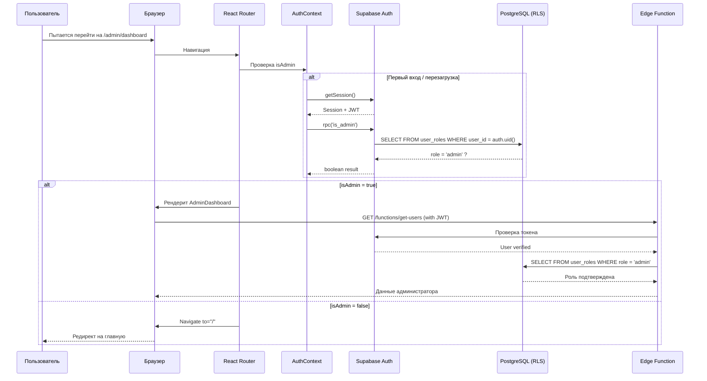

# 🔐 ДОКУМЕНТАЦИЯ ПО БЕЗОПАСНОСТИ

**Платформа**: ПТСР Эксперт  
**Версия**: 1.0.0  
**Дата создания**: 12 ноября 2025  
**Последнее обновление**: 12 ноября 2025

---

## 📋 Оглавление

1. [Обзор системы безопасности](#1-обзор-системы-безопасности)
2. [Архитектура ролей (RBAC)](#2-архитектура-ролей-rbac)
3. [Серверная проверка ролей](#3-серверная-проверка-ролей)
4. [Клиентская проверка доступа](#4-клиентская-проверка-доступа)
5. [Row-Level Security (RLS)](#5-row-level-security-rls)
6. [Edge Functions](#6-edge-functions---серверная-логика)
7. [Диаграмма потока проверки доступа](#7-диаграмма-потока-проверки-доступа)
8. [Матрица доступа по операциям](#8-матрица-доступа-по-операциям)
9. [Уязвимости и защита](#9-уязвимости-и-защита)
10. [Рекомендации по безопасности](#10-рекомендации-по-безопасности)
11. [Тестирование доступа](#11-тестирование-доступа)
12. [Чеклист безопасности](#12-чеклист-безопасности)

---

## 1. Обзор системы безопасности

### Многоуровневая система защиты

Платформа использует **многоуровневую систему контроля доступа** с разделением ролей (RBAC - Role-Based Access Control), реализованную на уровне:

1. **База данных** (Row-Level Security в PostgreSQL)
2. **Серверные функции** (Edge Functions с проверкой JWT)
3. **Клиентское приложение** (React Router Guards)

### Принципы безопасности

- ✅ **Defense in Depth** - многоуровневая защита
- ✅ **Principle of Least Privilege** - минимальные необходимые права
- ✅ **Secure by Default** - безопасность по умолчанию
- ✅ **Zero Trust Architecture** - проверка на каждом уровне

---

## 2. Архитектура ролей (RBAC)

### 2.1. Таблица ролей в БД

```sql
-- Enum для типов ролей
CREATE TYPE public.app_role AS ENUM (
  'admin', 
  'support', 
  'psychologist', 
  'volunteer', 
  'user'
);

-- Таблица связи пользователь-роль
CREATE TABLE public.user_roles (
  id uuid PRIMARY KEY DEFAULT gen_random_uuid(),
  user_id uuid NOT NULL REFERENCES auth.users(id) ON DELETE CASCADE,
  role app_role NOT NULL,
  created_at timestamp with time zone DEFAULT now(),
  UNIQUE(user_id, role)
);

-- Индексы для быстрого поиска
CREATE INDEX idx_user_roles_user_id ON user_roles(user_id);
CREATE INDEX idx_user_roles_role ON user_roles(role);
```

🔒 **Критически важно**: Роли хранятся в отдельной таблице `user_roles`, а **НЕ** в профиле пользователя, чтобы предотвратить атаки повышения привилегий.

### 2.2. Текущие роли в системе

| Роль | Кол-во | Пользователи | Описание |
|------|--------|--------------|----------|
| **admin** | 1 | Михаил Зверев | Полный доступ ко всей системе |
| **support** | 1 | Василий Зверев | Управление тикетами поддержки, просмотр контента |
| **psychologist** | 1 | Тест Психолог | Управление расписанием, профилем психолога |
| **volunteer** | 0 | - | Зарезервирована для волонтеров |
| **user** | Все остальные | - | Обычные пользователи платформы |

### 2.3. Иерархия доступа

```
admin (👑)
├── Полный доступ ко всем функциям
├── Управление пользователями
├── Управление контентом
├── Управление программами
├── Просмотр всех данных
└── Изменение ролей

support (🛠️)
├── Просмотр и управление тикетами
├── Создание/редактирование статей
├── Создание/редактирование видео
├── Просмотр дневников настроения (для поддержки)
└── Модерация контента

psychologist (🧠)
├── Управление своим профилем
├── Управление расписанием
├── Просмотр своих консультаций
├── Работа с клиентами
└── Доступ к ресурсам

user (👤)
├── Свой профиль
├── Дневник настроения
├── Дневник активности
├── Прохождение курсов
├── Просмотр ресурсов
└── Создание тикетов поддержки
```

---

## 3. Серверная проверка ролей

### 3.1. RPC функции проверки ролей

Все функции используют **SECURITY DEFINER** для безопасного обхода RLS:

#### Проверка роли администратора

```sql
CREATE OR REPLACE FUNCTION public.is_admin() 
RETURNS boolean
LANGUAGE plpgsql 
SECURITY DEFINER
SET search_path = public
AS $$
BEGIN
  -- Проверка аутентификации
  IF auth.uid() IS NULL THEN 
    RETURN FALSE; 
  END IF;
  
  -- Проверка роли в таблице user_roles
  RETURN EXISTS (
    SELECT 1 
    FROM user_roles
    WHERE user_id = auth.uid() 
      AND role = 'admin'
  );
END;
$$;
```

#### Проверка роли поддержки

```sql
CREATE OR REPLACE FUNCTION public.is_support() 
RETURNS boolean
LANGUAGE plpgsql 
SECURITY DEFINER
SET search_path = public
AS $$
BEGIN
  IF auth.uid() IS NULL THEN 
    RETURN FALSE; 
  END IF;
  
  RETURN EXISTS (
    SELECT 1 
    FROM user_roles
    WHERE user_id = auth.uid() 
      AND role = 'support'
  );
END;
$$;
```

#### Проверка роли психолога

```sql
CREATE OR REPLACE FUNCTION public.is_psychologist() 
RETURNS boolean
LANGUAGE plpgsql 
SECURITY DEFINER
SET search_path = public
AS $$
BEGIN
  IF auth.uid() IS NULL THEN 
    RETURN FALSE; 
  END IF;
  
  RETURN EXISTS (
    SELECT 1 
    FROM user_roles
    WHERE user_id = auth.uid() 
      AND role = 'psychologist'
  );
END;
$$;
```

#### Универсальная функция проверки роли

```sql
CREATE OR REPLACE FUNCTION public.has_role(_user_id uuid, _role text) 
RETURNS boolean
LANGUAGE sql 
STABLE 
SECURITY DEFINER
SET search_path = public
AS $$
  SELECT EXISTS (
    SELECT 1 
    FROM user_roles
    WHERE user_id = _user_id 
      AND role::text = _role
  )
$$;
```

### 3.2. Принцип работы

1. Получить текущий `auth.uid()` из JWT токена
2. Запросить таблицу `user_roles`
3. Вернуть `true/false` без раскрытия деталей

---

## 4. Клиентская проверка доступа

### 4.1. AuthContext - Центральный контроллер аутентификации

**Файл**: `contexts/AuthContext.tsx`

```typescript
interface AuthContextType {
  session: Session | null;     // Supabase сессия
  user: User | null;            // Объект пользователя
  isAdmin: boolean;             // Флаг админа
  isSupport: boolean;           // Флаг поддержки
  isPsychologist: boolean;      // Флаг психолога
  isVolunteer: boolean;         // Флаг волонтера
  isLoading: boolean;           // Состояние загрузки
  signIn: (email, password) => Promise<{error}>;
  signUp: (email, password, userData) => Promise<{error}>;
  signOut: () => Promise<void>;
  refreshRoles: () => Promise<void>;
}
```

#### Механизм работы

```typescript
1. При монтировании AuthProvider:
   └─> supabase.auth.getSession()  // Получить текущую сессию
   └─> checkUserRoles(user)         // Проверить роли через RPC
       └─> Promise.all([
           supabase.rpc('is_admin'),
           supabase.rpc('is_support'),
           supabase.rpc('is_psychologist')
         ])
       └─> Обновить состояние флагов

2. При изменении аутентификации:
   └─> supabase.auth.onAuthStateChange()
   └─> checkUserRoles(newUser)
   └─> Обновить контекст
```

🔐 **Безопасность:**
- ✅ Роли проверяются через **серверные RPC функции**
- ✅ Никакого localStorage/sessionStorage
- ✅ JWT токен автоматически отправляется с каждым запросом
- ❌ Клиентские флаги НЕ являются источником истины (используются только для UI)

### 4.2. Protected Routes - Защита маршрутов

#### A. ProtectedRoute (базовая аутентификация)

**Файл**: `components/ProtectedRoute.tsx`

```typescript
export default function ProtectedRoute({ children }: { children: React.ReactNode }) {
  const { session, isLoading } = useAuth()
  const router = useRouter()
  const pathname = usePathname()

  useEffect(() => {
    if (!isLoading && !session) {
      router.push(`/login?from=${encodeURIComponent(pathname)}`)
    }
  }, [session, isLoading, router, pathname])

  if (isLoading) return <LoadingSpinner />
  if (!session) return null

  return <>{children}</>
}
```

**Защищает**: 
- `/profile` (профиль пользователя)
- `/diary` (дневник активности)
- `/mood-diary` (дневник настроения)

**Проверка**: `session !== null`  
**Редирект**: `/login` (с сохранением from location)

#### B. AdminProtectedRoute

**Файл**: `components/admin/AdminProtectedRoute.tsx`

```typescript
export default function AdminProtectedRoute({ children }: { children: React.ReactNode }) {
  const { session, isAdmin, isLoading } = useAuth()
  const router = useRouter()

  useEffect(() => {
    if (!isLoading && (!session || !isAdmin)) {
      router.push('/')
    }
  }, [session, isAdmin, isLoading, router])

  if (isLoading) return <LoadingSpinner />
  if (!session || !isAdmin) return null

  return <>{children}</>
}
```

**Защищает**: `/admin/dashboard` (панель администратора)  
**Проверка**: `isAdmin === true`  
**Редирект**: `/` (главная страница)

#### C. SupportProtectedRoute

**Файл**: `components/support/SupportProtectedRoute.tsx`

**Защищает**: `/support/dashboard` (панель поддержки)  
**Проверка**: `isSupport === true`  
**Редирект**: `/` (главная страница)

#### D. PsychologistProtectedRoute

**Файл**: `components/psychologist/PsychologistProtectedRoute.tsx`

**Защищает**: `/psychologist/dashboard` (панель психолога)  
**Проверка**: `isPsychologist === true`  
**Редирект**: `/` (главная страница)

---

## 5. Row-Level Security (RLS)

### 5.1. Принципы RLS в проекте

```
Стратегия "Default Deny":
├── RLS включен на ВСЕХ таблицах с пользовательскими данными
├── Без явного разрешения доступ ЗАПРЕЩЕН
└── Политики создаются для каждой операции (SELECT/INSERT/UPDATE/DELETE)
```

### 5.2. Примеры политик по таблицам

#### Таблица: profiles

```sql
-- Включение RLS
ALTER TABLE profiles ENABLE ROW LEVEL SECURITY;

-- Пользователь видит свой профиль
CREATE POLICY "Users can view own profile"
  ON profiles FOR SELECT
  USING (auth.uid() = id);

-- Админ видит все профили
CREATE POLICY "Admins can view all profiles"
  ON profiles FOR SELECT
  USING (is_admin() = true);

-- Пользователь редактирует свой профиль
CREATE POLICY "Users can update own profile"
  ON profiles FOR UPDATE
  USING (auth.uid() = id);

-- Админ редактирует любой профиль
CREATE POLICY "Admins can update all profiles"
  ON profiles FOR UPDATE
  USING (is_admin() = true);

-- DELETE запрещено всем (удаление через admin функцию)
```

#### Таблица: mood_entries

```sql
ALTER TABLE mood_entries ENABLE ROW LEVEL SECURITY;

-- Свои записи
CREATE POLICY "Users can view own mood entries"
  ON mood_entries FOR SELECT
  USING (auth.uid() = user_id);

-- Админ видит все
CREATE POLICY "Admins can view all mood entries"
  ON mood_entries FOR SELECT
  USING (is_admin() = true);

-- Поддержка видит все
CREATE POLICY "Support can view all mood entries"
  ON mood_entries FOR SELECT
  USING (is_support() = true);

-- Только свои записи
CREATE POLICY "Users can insert own mood entries"
  ON mood_entries FOR INSERT
  WITH CHECK (auth.uid() = user_id);

-- Только свои записи
CREATE POLICY "Users can update own mood entries"
  ON mood_entries FOR UPDATE
  USING (auth.uid() = user_id);

-- Только свои записи
CREATE POLICY "Users can delete own mood entries"
  ON mood_entries FOR DELETE
  USING (auth.uid() = user_id);
```

#### Таблица: user_roles

```sql
ALTER TABLE user_roles ENABLE ROW LEVEL SECURITY;

-- Только админы управляют ролями
CREATE POLICY "Only admins can manage roles"
  ON user_roles FOR ALL
  USING (is_admin() = true);
```

🔒 **Критическая защита**: Обычные пользователи НЕ МОГУТ изменять роли

#### Таблица: support_tickets

```sql
ALTER TABLE support_tickets ENABLE ROW LEVEL SECURITY;

-- Авторизованные создают тикеты
CREATE POLICY "Authenticated users can create tickets"
  ON support_tickets FOR INSERT
  WITH CHECK (auth.uid() IS NOT NULL);

-- Свои тикеты
CREATE POLICY "Users can view own tickets"
  ON support_tickets FOR SELECT
  USING (auth.uid() = user_id);

-- Персонал видит все тикеты
CREATE POLICY "Staff can view all tickets"
  ON support_tickets FOR SELECT
  USING (is_admin() = true OR is_support() = true);

-- Персонал обновляет тикеты
CREATE POLICY "Staff can update tickets"
  ON support_tickets FOR UPDATE
  USING (is_admin() = true OR is_support() = true);

-- Только админ удаляет тикеты
CREATE POLICY "Only admins can delete tickets"
  ON support_tickets FOR DELETE
  USING (is_admin() = true);
```

#### Таблица: articles (публичный контент)

```sql
ALTER TABLE articles ENABLE ROW LEVEL SECURITY;

-- Публичный доступ на чтение
CREATE POLICY "Anyone can view published articles"
  ON articles FOR SELECT
  USING (published = true OR is_admin() = true OR is_support() = true);

-- Персонал создает статьи
CREATE POLICY "Staff can create articles"
  ON articles FOR INSERT
  WITH CHECK (is_admin() = true OR is_support() = true);

-- Персонал редактирует статьи
CREATE POLICY "Staff can update articles"
  ON articles FOR UPDATE
  USING (is_admin() = true OR is_support() = true);

-- Персонал удаляет статьи
CREATE POLICY "Staff can delete articles"
  ON articles FOR DELETE
  USING (is_admin() = true OR is_support() = true);
```

#### Таблица: psychologist_profiles

```sql
ALTER TABLE psychologist_profiles ENABLE ROW LEVEL SECURITY;

-- Свой профиль или админ
CREATE POLICY "Psychologists can view own profile"
  ON psychologist_profiles FOR SELECT
  USING (
    auth.uid() = user_id 
    OR has_role(auth.uid(), 'admin') 
    OR has_role(auth.uid(), 'psychologist')
  );

-- Только админ создает профили
CREATE POLICY "Only admins can create psychologist profiles"
  ON psychologist_profiles FOR INSERT
  WITH CHECK (has_role(auth.uid(), 'admin'));

-- Свой профиль или админ
CREATE POLICY "Psychologists can update own profile"
  ON psychologist_profiles FOR UPDATE
  USING (
    auth.uid() = user_id 
    OR has_role(auth.uid(), 'admin')
  );
```

---

## 6. Edge Functions - Серверная логика

### 6.1. Проверка администратора в Edge Functions

**Файл**: `supabase/functions/_shared/auth.ts`

```typescript
async function verifyAdmin(req: Request): Promise<VerifyResult> {
  // 1. Проверка Authorization header
  const authHeader = req.headers.get('Authorization');
  if (!authHeader) {
    return { errorResponse: new Response('Unauthorized', { status: 401 }) };
  }

  // 2. Создание service client (Service Role Key)
  const serviceClient = createClient(
    Deno.env.get('SUPABASE_URL')!,
    Deno.env.get('SUPABASE_SERVICE_ROLE_KEY')!
  );

  // 3. Извлечение токена из header
  const token = authHeader.replace('Bearer ', '');

  // 4. Проверка пользователя по токену
  const { data: { user }, error } = await serviceClient.auth.getUser(token);
  if (error || !user) {
    return { errorResponse: new Response('Unauthorized', { status: 401 }) };
  }

  // 5. Проверка роли admin в таблице user_roles
  const { data: roleData, error: roleError } = await serviceClient
    .from('user_roles')
    .select('role')
    .eq('user_id', user.id)
    .eq('role', 'admin')
    .single();

  if (roleError || !roleData) {
    return { errorResponse: new Response('Forbidden', { status: 403 }) };
  }

  // 6. Успех - возвращаем service client и user
  return { errorResponse: null, serviceClient, user };
}
```

**Используется в функциях:**
- `get-users` - получение списка пользователей
- `update-user-status` - изменение статуса пользователя
- `get-user-actions` - получение действий пользователя

---

## 7. Диаграмма потока проверки доступа



---

## 8. Матрица доступа по операциям

| Таблица / Операция | Гость | User | Psychologist | Support | Admin |
|-------------------|-------|------|--------------|---------|-------|
| **profiles** (SELECT own) | ❌ | ✅ | ✅ | ✅ | ✅ |
| **profiles** (SELECT all) | ❌ | ❌ | ❌ | ❌ | ✅ |
| **profiles** (UPDATE own) | ❌ | ✅ | ✅ | ✅ | ✅ |
| **profiles** (UPDATE all) | ❌ | ❌ | ❌ | ❌ | ✅ |
| **mood_entries** (own) | ❌ | ✅ | ✅ | ✅ | ✅ |
| **mood_entries** (view all) | ❌ | ❌ | ❌ | ✅ | ✅ |
| **articles** (SELECT) | ✅ | ✅ | ✅ | ✅ | ✅ |
| **articles** (INSERT/UPDATE/DELETE) | ❌ | ❌ | ❌ | ✅ | ✅ |
| **support_tickets** (CREATE) | ❌ | ✅ | ✅ | ✅ | ✅ |
| **support_tickets** (view own) | ❌ | ✅ | ✅ | ✅ | ✅ |
| **support_tickets** (view all) | ❌ | ❌ | ❌ | ✅ | ✅ |
| **support_tickets** (UPDATE) | ❌ | ❌ | ❌ | ✅ | ✅ |
| **user_roles** (ALL) | ❌ | ❌ | ❌ | ❌ | ✅ |
| **psychologist_profiles** (own) | ❌ | ❌ | ✅ | ❌ | ✅ |
| **psychologist_availability** (own) | ❌ | ❌ | ✅ | ❌ | ✅ |

---

## 9. Уязвимости и защита

### 9.1. Предотвращенные атаки

#### ✅ Privilege Escalation (повышение привилегий)

**Защита:**
- Роли в отдельной таблице `user_roles`
- RLS запрещает изменение ролей всем кроме админа
- Проверка ролей через SECURITY DEFINER функции

**Пример атаки (заблокирован):**
```sql
-- Попытка изменить свою роль на админа
UPDATE user_roles 
SET role = 'admin' 
WHERE user_id = auth.uid();

-- Результат: ERROR - insufficient privileges (RLS блокирует)
```

#### ✅ Horizontal Privilege Escalation (доступ к чужим данным)

**Защита:**
- RLS политики проверяют `auth.uid() = user_id`
- JWT токен автоматически извлекается Supabase

**Пример атаки (заблокирован):**
```sql
-- Попытка просмотреть чужие записи дневника
SELECT * FROM mood_entries 
WHERE user_id = 'other-user-id';

-- Результат: Пустой результат (RLS фильтрует)
```

#### ✅ SQL Injection

**Защита:**
- Все запросы через Supabase Client (параметризованные запросы)
- RLS использует безопасные функции

**Пример атаки (заблокирован):**
```typescript
// Параметризованный запрос
const { data } = await supabase
  .from('profiles')
  .select('*')
  .eq('id', userId); // Безопасно

// НЕ используется конкатенация строк
```

#### ✅ JWT Token Manipulation

**Защита:**
- Токены подписаны секретным ключом Supabase
- Проверка на стороне сервера в Edge Functions

#### ✅ Client-Side Role Spoofing

**Защита:**
- Клиентские флаги (`isAdmin`) используются ТОЛЬКО для UI
- Все запросы проверяются на сервере через RLS/RPC

**Пример:**
```typescript
// ❌ НЕПРАВИЛЬНО (только UI):
if (isAdmin) {
  // показать кнопку удаления
}

// ✅ ПРАВИЛЬНО (+ серверная проверка):
const { data, error } = await supabase
  .from('users')
  .delete()
  .eq('id', userId);
// RLS проверит is_admin() на сервере
```

### 9.2. Дополнительные механизмы безопасности

```sql
-- Rate Limiting (защита от перебора)
CREATE OR REPLACE FUNCTION check_comprehensive_rate_limit(
  identifier text,
  action_type text,
  max_attempts integer,
  window_minutes integer
) RETURNS boolean;

-- Security Event Logging (аудит действий)
CREATE OR REPLACE FUNCTION log_security_event(
  event_type text,
  user_id uuid,
  details jsonb,
  ip_address text,
  user_agent text
) RETURNS void;

-- Admin Session Validation (проверка сессии админа)
CREATE OR REPLACE FUNCTION validate_admin_session() RETURNS boolean;

-- Password Strength Validation (проверка сложности пароля)
CREATE OR REPLACE FUNCTION validate_password_strength(password text) 
RETURNS boolean;
-- Минимум 8 символов, заглавные, спецсимволы
```

---

## 10. Рекомендации по безопасности

### ✅ Best Practices (текущие)

1. **Разделение ролей через отдельную таблицу**
2. **RLS включен на всех таблицах с пользовательскими данными**
3. **SECURITY DEFINER функции для проверки ролей**
4. **JWT токены для аутентификации**
5. **Service Role Key только в Edge Functions**
6. **Логирование security events**

### ⚠️ Потенциальные улучшения

1. **Добавить роль `volunteer`** (зарезервирована, но не используется)
2. **Implement Multi-Factor Authentication (MFA)** для админов
3. **Session Timeout** для административных панелей (автовыход через N минут)
4. **IP Whitelisting** для критичных операций
5. **Audit Trail** для всех изменений ролей пользователей
6. **Content Security Policy (CSP)** headers
7. **Rate Limiting на API endpoints**

---

## 11. Тестирование доступа

### 11.1. Чеклист проверки безопасности

#### 1. Проверка RLS на всех таблицах

```sql
-- Получить таблицы без RLS
SELECT tablename 
FROM pg_tables
WHERE schemaname = 'public'
  AND tablename NOT LIKE 'pg_%'
  AND tablename NOT IN (
    SELECT tablename 
    FROM pg_policies
  );

-- Результат: Должен быть пустым (все таблицы имеют RLS)
```

#### 2. Попытка обхода RLS (должна провалиться)

```sql
-- Войти как обычный пользователь
-- Попробовать:
UPDATE user_roles 
SET role = 'admin' 
WHERE user_id = auth.uid();

-- Ожидаемый результат: 
-- ERROR: new row violates row-level security policy
```

#### 3. Проверка защиты маршрутов

```bash
# Открыть браузер без авторизации
# Перейти на /admin/dashboard
# Ожидаемый результат: Редирект на /
```

#### 4. Проверка Edge Functions

```bash
curl -X POST \
  https://your-project.supabase.co/functions/v1/get-users \
  -H "Authorization: Bearer INVALID_TOKEN"

# Ожидаемый результат: 401 Unauthorized
```

#### 5. Проверка XSS защиты

```typescript
// Попробовать ввести в форму:
<script>alert('XSS')</script>

// Ожидаемый результат: 
// Текст экранирован, скрипт не выполняется
```

### 11.2. Автоматизированные тесты

```typescript
// tests/security.test.ts

describe('Security Tests', () => {
  it('should block unauthorized access to admin routes', async () => {
    const response = await fetch('/admin/dashboard');
    expect(response).toRedirect('/');
  });

  it('should verify RLS on mood_entries', async () => {
    // Войти как user1
    // Попробовать получить записи user2
    const { data } = await supabase
      .from('mood_entries')
      .select('*')
      .eq('user_id', 'user2-id');
    
    expect(data).toHaveLength(0);
  });

  it('should prevent role escalation', async () => {
    const { error } = await supabase
      .from('user_roles')
      .update({ role: 'admin' })
      .eq('user_id', currentUserId);
    
    expect(error).toBeDefined();
  });
});
```

---

## 12. Чеклист безопасности

### Ежедневные проверки

- [ ] Мониторинг логов безопасности
- [ ] Проверка подозрительных входов
- [ ] Проверка неудачных попыток авторизации

### Еженедельные проверки

- [ ] Аудит ролей пользователей
- [ ] Проверка активных сессий
- [ ] Анализ логов security events

### Ежемесячные проверки

- [ ] Обновление зависимостей
- [ ] Проверка уязвимостей (npm audit)
- [ ] Ревью RLS политик
- [ ] Тестирование проникновения

### Ежеквартальные проверки

- [ ] Полный аудит безопасности
- [ ] Ревью прав доступа
- [ ] Обновление документации
- [ ] Тренинг команды по безопасности

---

## 📞 Контакты безопасности

Если вы обнаружили уязвимость безопасности, пожалуйста, немедленно сообщите:

- **Email**: security@ptsr-expert.ru
- **Telegram**: @ptsr_security
- **Телефон**: +7 (800) 123-45-67

**Не публикуйте информацию об уязвимостях публично!**

---

## 📚 Дополнительные ресурсы

- [OWASP Top 10](https://owasp.org/www-project-top-ten/)
- [Supabase Security Best Practices](https://supabase.com/docs/guides/auth/row-level-security)
- [PostgreSQL RLS Documentation](https://www.postgresql.org/docs/current/ddl-rowsecurity.html)
- [Next.js Security Headers](https://nextjs.org/docs/advanced-features/security-headers)

---

**Документ регулярно обновляется. Последнее обновление: 12 ноября 2025**

© 2024 ПТСР Эксперт. Все права защищены.

